# WashBuddy — Visual Reference

**Document type:** Annotated visual specification for the merged Find a Wash surface.

**Audience:** Claude Code, designers, and anyone implementing or reviewing the redesign.

**How to use this document:** Each section covers a single surface or component. Visuals live as standalone SVG files in the `visuals/` subfolder, referenced inline. SVG renders crisply at any zoom and is human-readable text — Claude Code can read individual visual files directly to extract specific design tokens (colors, dimensions, spacing) when implementing.

**Brand color reference (sampled from existing app):** primary blue is `#2D6FE3`. This supersedes any earlier reference to `#185FA5` in the codebase.

---

## Table of contents

1. [Color tokens](#1-color-tokens)
2. [Typography tokens](#2-typography-tokens)
3. [Spacing tokens](#3-spacing-tokens)
4. [The pin](#4-the-pin)
5. [The search header — two presentation modes](#5-the-search-header--two-presentation-modes)
6. [Tier 1 filter chips](#6-tier-1-filter-chips)
7. [Active filter pills](#7-active-filter-pills)
8. [Result cards](#8-result-cards)
9. [The bottom sheet — three states](#9-the-bottom-sheet--three-states)
10. [The service picker sheet](#10-the-service-picker-sheet)
11. [The all-filters sheet](#11-the-all-filters-sheet)
12. [Pin selection callout](#12-pin-selection-callout)
13. [Empty, loading, and error states](#13-empty-loading-and-error-states)
14. [Desktop layout](#14-desktop-layout)

---

## 1. Color tokens

| Token | Hex | Usage |
|---|---|---|
| `wb-blue` | `#2D6FE3` | Primary brand color. Pin top-tier, primary CTA, selected chip, route line. |
| `wb-blue-dark` | `#1F52B0` | Hover state on primary, text on light blue backgrounds. |
| `wb-blue-light` | `#6B9AED` | Pin mid-tier, secondary accent. |
| `wb-blue-50` | `#EBF2FD` | Selected card background, light backgrounds for blue accents. |
| `wb-green` | `#15803D` | Open status indicator, origin marker. |
| `wb-amber` | `#B45309` | Warning state (incompatible vehicle), Closes-soon status. |
| `wb-red` | `#B91C1C` | Destination marker, error state. |
| `wb-text` | `#0F172A` | Primary body text. |
| `wb-text-2` | `#475569` | Secondary text (metadata, captions). |
| `wb-text-3` | `#94A3B8` | Tertiary text (placeholders, disabled). |
| `wb-bg` | `#FFFFFF` | Card and surface backgrounds. |
| `wb-bg-2` | `#F8FAFC` | Hover and demoted card backgrounds. |
| `wb-bg-3` | `#F1F5F9` | Pill backgrounds, segmented control inactive. |
| `wb-border` | `#E2E8F0` | Default 0.5px borders. |
| `wb-border-2` | `#CBD5E1` | Hover and emphasized borders. |

Service category colors (used for service icons in picker, pin glyphs, filter section accents):

| Category | Background (light) | Foreground (dark) |
|---|---|---|
| Exterior wash | `#DBEAFE` (Blue 50) | `#1E40AF` (Blue 800) |
| Interior cleaning | `#FEF3C7` (Amber 50) | `#92400E` (Amber 800) |
| Restroom dump | `#D1FAE5` (Teal/Green 50) | `#065F46` (Teal 800) |
| Restock & consumables | `#EDE9FE` (Purple 50) | `#5B21B6` (Purple 800) |
| Add-ons | `#FCE7F3` (Pink 50) | `#9D174D` (Pink 800) |

These tokens become the WashBuddy service color system. Use consistently across the app — service chips on cards, picker icons, filter section headers, location detail pages.

---

## 2. Typography tokens

System font stack: `ui-sans-serif, system-ui, -apple-system, sans-serif`.

| Role | Size | Weight | Color |
|---|---|---|---|
| Page title (sheet headers) | 17px | 500 | `wb-text` |
| Card title (provider name) | 14px | 500 | `wb-text` |
| Card metadata | 11.5px | 400 | `wb-text-2` |
| Card metadata emphasis (detour) | 11.5px | 500 | `wb-text` |
| Open status | 11px | 500 | `wb-green` (or amber/red) |
| Price | 13px | 500 | `wb-text` |
| Price label ("Est." / "From") | 10px | 400 | `wb-text-3` |
| Service pill | 10.5px | 500 | varies by state |
| Filter chip | 12.5px | 500 | varies by state |
| Section header (filter sheet) | 11px | 500 uppercase, 0.6px letter-spacing | `wb-text-2` |
| TOP badge | 9px | 500 uppercase, 0.4px letter-spacing | white on `wb-blue` |
| Pin label (top-tier) | 10px | 500 | white on `wb-blue` |
| Pin label (mid-tier at zoom ≥13) | 9.5px | 500 | `wb-blue-dark` on white |
| Tap target minimum | 44×44px | — | — (per iOS HIG) |

No font weight other than 400 and 500. No mid-sentence bolding. Sentence case throughout — never Title Case or ALL CAPS, except the four uppercase tokens noted above (TOP badge, "LISTING ONLY" tag, section headers, and the `XL`/`L`/`M`/`S` vehicle size avatars).

---

## 3. Spacing tokens

| Token | Value | Usage |
|---|---|---|
| Border radius (small) | 4px | Pill insides, badges, service pills |
| Border radius (medium) | 8px | Map control buttons, filter sheet rows |
| Border radius (large) | 12px | Cards, search card, modal sheets, pin callouts |
| Border radius (XL) | 22px | Bottom sheet top corners |
| Border radius (full) | 999px | Chips, search pill, vehicle pill, segmented controls |
| Card padding (vertical) | 12px | Result cards |
| Card padding (horizontal) | 16px | Result cards |
| Sheet padding (horizontal) | 16px | Bottom sheet content |
| Standard gap | 8px | Between chips, between pill content |
| Tight gap | 4px | Between service pill items |
| Section gap | 18px | Between filter sections |
| Drop shadow (light) | `0 1px 2px rgba(15,23,42,0.06)` | Cards on flat surfaces |
| Drop shadow (medium) | `0 2px 6px rgba(15,23,42,0.10)` | Floating buttons, map controls |
| Drop shadow (heavy) | `0 4px 16px rgba(15,23,42,0.15)` | Pin callouts, modal sheets |
| Bottom sheet shadow | `0 -8px 28px rgba(15,23,42,0.10)` | Bottom sheet only (upward shadow) |

---

## 4. The pin

The pin is the most-seen element in the app. It encodes ranking through color, primary service through inner glyph, and detour time through the always-visible label on top-tier pins.

### 4.1 Pin shape and color tiers

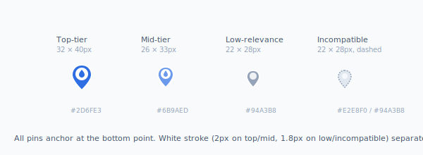

**Color tier rules:**
- **Top-tier:** the top 3 results by best-fit score, OR the top 25% of compatible matches, whichever is smaller. These are the pins the user should see first.
- **Mid-tier:** rest of compatible matches with detour ≤20 min (route mode) or within search radius (nearby mode).
- **Low-relevance:** locations matching filters but with detour >20 min, OR matching filters but currently outside the visible map bounds. Still visible but visually de-prioritized.
- **Incompatible:** locations that fail Tier 0 (vehicle bay-fit). Visible for context; not bookable.

### 4.2 Pin labels

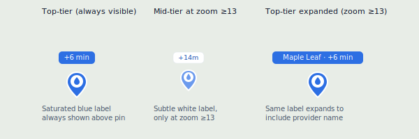

**Label content varies by mode:**
- Route mode with destination set: detour time ("+6 min", "+14m" — full units on top-tier, abbreviated on mid-tier).
- Nearby mode with no service selected: distance ("2.9 mi", "5.1 mi").
- Nearby mode with single service selected: price ("$135", "$98").
- Nearby mode with multiple services selected: estimated price for bundle ("Est. $135").

**Why this matters:** the labels do work that would otherwise require chip filters or sort indicators. The user scans the map and immediately sees decision-relevant numbers without tapping.

### 4.3 Selected pin state

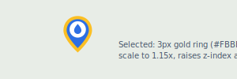

The gold ring preserves the existing selected-state visual. Scale-up adds emphasis without growing the hit area dramatically (which would change tap behavior). The selected pin pops above any clustered neighbors via z-index.

### 4.4 Pin clustering

At zoom <11, pins within 40px of each other cluster. Cluster pin shows the count and inherits the highest-relevance color of its members (a cluster containing one top-tier and three mid-tier pins is colored as top-tier). Tap to expand: zooms in to the next zoom level showing individual pins.

Use Leaflet.markercluster (BSD-2-Clause license, ~10KB gzipped). No custom clustering logic needed.

---

## 5. The search header — two presentation modes

The header has two presentation modes that switch based on bottom sheet state. The collapsed mode is the default for route mode (where the map is the primary surface); the expanded mode appears when the user drags the sheet up.

### 5.1 Collapsed mode (sheet at peek)

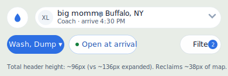

**Annotations:**
- Top-left circle button is the floating logomark (or back chevron when reached via navigation — see PRD §3.8).
- Unified pill consolidates vehicle and destination summary on one element. Two-line content: vehicle name + destination on top, vehicle type + arrival time below. Tap expands the pill into full edit mode.
- Three chips on a single row, no horizontal scroll at viewports ≥360px. Service Type left-aligned (primary action), Filters right-aligned (`margin-left: auto`) for thumb reach.
- Translucent backgrounds (`rgba(255,255,255,0.96)`) with backdrop-blur let map texture peek through, signaling that this layer floats over the map rather than claiming its own zone.
- Service Type chip stays solid blue when selections are active (its prominence justifies the opacity break).

### 5.2 Expanded mode (sheet at default or expanded)

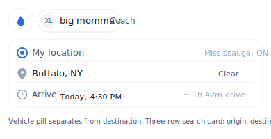

**When this mode is shown:**
- Always in nearby mode (sheet defaults to default state, header is expanded).
- In route mode when the user drags the sheet up to default or expanded state.

**Animation between modes:** parameterize header by sheet state. Use framer-motion shared layout IDs so the search pill smoothly expands into the search card as the user drags. Single coordinated animation, not two separate ones.

---

## 6. Tier 1 filter chips

Three chips. Always visible (in both header presentation modes). Single row, no horizontal scroll at viewports ≥360px.

### 6.1 Service Type chip — adaptive label

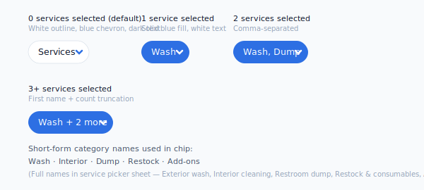

**Tap behavior:** opens the service picker sheet (§10).

**Why "Services" not "Any service":** the noun is the affordance — "this is where you pick services" — and the chevron is the verb. Adding "Any" reads as a description rather than an action. OpenTable, Airbnb, and Booking all use the noun-first pattern.

### 6.2 Open at arrival / Open now chip

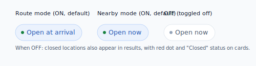

**Tap behavior:** pure toggle. No sheet opens. Re-runs the search.

### 6.3 Filters chip

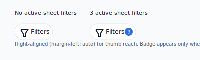

---

## 7. Active filter pills

When filters from the all-filters sheet are active, small removable pills appear below the chip row. Critical guardrail against silent over-filtering.

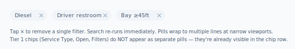

---

## 8. Result cards

Used in the bottom sheet on mobile and in the right rail on desktop. Single component, behavior identical across nearby and route modes — only the metadata line changes.

### 8.1 Top-tier card (route mode, services selected)

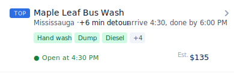

**Card structure:**
- **Rank column** (left, 32px wide): TOP badge for top-tier; numeric ("3", "4", ...) for ranks 4+; nothing for nearby mode beyond top.
- **Name** (14px / 500): provider's `Location.name`.
- **Chevron** (right): navigates to provider detail / booking flow.
- **Metadata line** (11.5px / 400-500): city · detour (bolded) · arrival/done time when applicable.
- **Service pills** (10.5px / 500): green-tinted (`#D1FAE5` / `#065F46`) for available, gray strikethrough for selected-but-missing, neutral gray for "+N more".
- **Open status** (11px / 500 / `#15803D`): colored dot + text. See §8.4.
- **Price** (13px / 500): right-aligned. Conditional on selection state. See §8.5.

### 8.2 Selected card

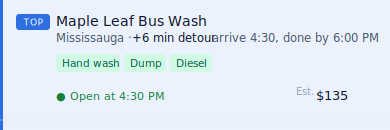

**Selected state:**
- Background: `#EBF2FD` (blue 50 tint).
- Left border accent: 3px solid `#2D6FE3`.
- Card body shifts right by 3px (or padding-left increases by 3px) to compensate for the accent stripe — text alignment doesn't shift visually.

### 8.3 Bay-incompatible card (Tier 0 demoted)

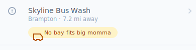

**Demoted state:**
- Background: `#F8FAFC` (slight gray tint).
- Provider name: `#475569` (secondary text color, not primary).
- Rank column: info icon (`#94A3B8`) instead of TOP badge.
- Amber chip: `#FEF3C7` background, `#92400E` text. Truck-with-X icon prefix.
- Chevron stays but in lighter gray; tapping opens an explainer modal rather than a booking flow.

### 8.4 Open status states

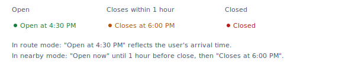

### 8.5 Price display states

| Selection state | Price label | Example |
|---|---|---|
| No service selected | (no price line — collapses to single open-status row) | — |
| One service selected | `From $XX` — minimum across that location's matching services | `From $51` |
| Multiple services selected | `Est. $XXX` — sum of base prices for selected services | `Est. $135` |

The `Est.` and `From` prefixes use the small label style (10px / 400 / `#94A3B8`). The dollar amount uses the price style (13px / 500 / `#0F172A`).

### 8.6 Rating display (gated)

Star ratings appear only when a provider has crossed the minimum review threshold (default: 5 reviews). Below threshold, no rating element renders — not even "No reviews yet."

When shown, format is: `★ 4.6 (23)` — appended to the open status line, separated by `·`.

```
● Open at 4:30 PM · ★ 4.6 (23)
```

Threshold is a feature flag, not a hardcoded constant.

---

## 9. The bottom sheet — three states

### 9.1 Peek state

~96px tall. The default for route mode.

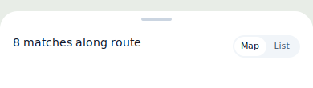

**Header at peek:** count + segmented Map/List toggle. No summary line — the trip metrics live in the search pill at the top of the screen, not duplicated here.

### 9.2 Default state

~50% of viewport. The default for nearby mode.

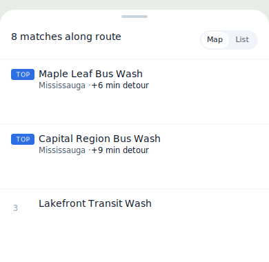

**Top 3-4 cards visible**, scroll for more. Map remains visible above (where viewport ends).

### 9.3 Expanded state

~85% of viewport. Map shrinks to a thin strip; full list visible.

When expanded, the sheet header gains an additional small line: `Sorted by best fit` (or `shortest detour`, etc.). Tappable to change sort.

### 9.4 State transitions

| From | Action | To |
|---|---|---|
| Any | Drag handle and release | Snap to nearest state (peek/default/expanded) |
| Any | Tap drag handle | Cycle peek → default → expanded → peek |
| Peek | Tap pin | Snap to default |
| Default or Expanded | Tap pin | Stay at current state, scroll/highlight matching card |
| Any | Tap empty map area | Deselect (no state change) |
| Any | Tap List view tab | Snap to expanded |
| Any | Tap Map view tab | Snap to peek |

Use velocity-aware snap on drag release: fast flick can jump two states; slow drag snaps to nearest.

---

## 10. The service picker sheet

Modal bottom sheet, opens from Service Type chip. Five categories, multi-select, live counts.

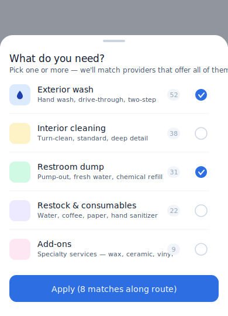

**Each row:**
- Service icon (36×36px) with category color (see §1).
- Category name (14px / 500).
- Subcategory hint text (11px / 400 / `wb-text-2`).
- Match count pill on right.
- Selection checkmark (right edge).

**Apply button:** updates count live as user toggles. The count includes other already-applied filters.

**Critical dependency:** counts and filter logic require the service taxonomy from `03-service-taxonomy-decision.md`. Round 0 of phasing must complete first.

---

## 11. The all-filters sheet

Full-screen-ish modal sheet (max height ~85% viewport). Sections in order:

1. **Sort by** — single-select radio (always visible, no header collapse)
2. **Availability** — Available now toggle, Walk-ins toggle, Open 24/7 toggle
3. **Service details** — subcategories (collapsed unless services selected)
4. **Fuel & convenience** — Diesel, DEF, high-flow pumps
5. **Driver amenities** — Restroom, lounge, Wi-Fi, coffee, showers
6. **Coach amenities** — Overnight parking, shore power, potable water
7. **Repair & roadside** (LISTING ONLY tag) — Mobile, tire, A/C, electrical, towing
8. **Compliance** — Certified disposal
9. **Bay accommodation** — override for vehicle filter

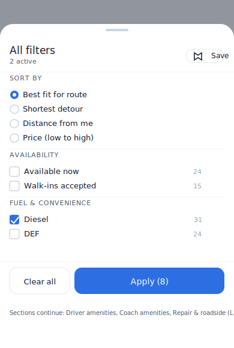

**Each filter option:**
- Standard checkbox (16×16px, accent color `wb-blue` when checked)
- Label (13px / 400 / `wb-text`)
- Match count (right-aligned, 11px / `wb-text-3`)

**Disabled options** (filter would result in 0 matches given current other filters):
- Checkbox grayed out, not interactive.
- Label `wb-text-3`.
- Count: strikethrough.
- Cursor: not-allowed.

**Footer (sticky bottom):**
- Clear all (left, 1/3 width, transparent with `wb-border-2` border, 13px / 500 / `wb-text`)
- Apply ({N} matches) (right, 2/3 width, `wb-blue` background, white 14px / 500)
- Both 44px tall, 12px corner radius.

Apply button count updates live as filters change inside the sheet.

---

## 12. Pin selection callout

When a pin is tapped, a callout opens above the pin showing key info and a primary CTA.

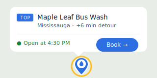

**Callout structure:**
- White card (12px radius) with heavy drop shadow.
- Pointing triangle below (12×12px, rotated, same shadow).
- TOP badge + provider name + city + detour line.
- Divider.
- Open status (left) + Book button (right, primary blue, 28px tall pill).
- Tapping anywhere on the card body (not the Book button) snaps the bottom sheet to default state and scrolls to the matching card.
- Tapping Book button navigates directly to the booking flow.

**Selected pin:** simultaneously gains the gold ring and 1.15x scale.

---

## 13. Empty, loading, and error states

### 13.1 Loading

| Surface | Skeleton |
|---|---|
| Initial page load | Map fades in (tile layer). 3 placeholder cards in bottom sheet (gray bars at name + meta line positions). Pin layer renders empty until first results arrive. |
| Detour recompute | Cards in route mode show "Computing detour…" gray skeleton on the meta line. Card otherwise interactive. |
| Filter change | Sheet count fades, shows "Loading…" inline. Cards fade slightly. New cards fade in. |

### 13.2 Empty

| Scenario | UI |
|---|---|
| Zero results match filters | Centered illustration (small, inline below sheet header), "No washes match your filters" message, prominent "Clear filters" CTA. |
| User has no active vehicle yet | Block search experience. "Add your first vehicle to see compatible washes." CTA → My Vehicles. |
| Geolocation denied | Inline banner above search card: "Couldn't get your location. Search by city instead." Origin field is editable; user types a city. |

### 13.3 Error

| Scenario | UI |
|---|---|
| OSRM route failed | Top banner: "Couldn't compute route. Showing locations near you instead." Falls back to nearby mode. |
| Detour-time API failed | Falls back to ETA-from-origin + distance + multiplier. Cards show "+~12 min detour" with `~` indicating approximation. Toast: "Detour times are approximate." |
| Specific location detail failed | Card shows but with grayed CTA. "Couldn't load details. Tap to retry." |

---

## 14. Desktop layout

The merged search page on desktop uses a two-column layout:

- **Left rail:** ~400px wide, contains the search header (origin, destination, time, chips), active filter pills, and the result list.
- **Right side:** map fills the rest of the viewport.
- **No bottom sheet** — the "sheet" is just the result list pinned in the left rail.
- **Pin selection** — clicking a pin highlights both the pin (gold ring + scale-up) and the matching list card (blue accent + left border). The list scrolls to bring the selected card into view.
- **Filter and service picker sheets** — render as centered modals (max-width 480px) rather than bottom sheets.
- **Map controls and "Search this area" button** — same as mobile, just with more breathing room.
- **Header collapsed/expanded modes** are not relevant on desktop; the search header is always shown in expanded form in the left rail.

Implementation: use Tailwind responsive variants. `lg:grid-cols-[400px_1fr]` for the layout; bottom sheet component renders only on mobile via `lg:hidden`.

---

## Document version

**v1.0** — initial visual reference produced alongside PRD v1.0 and EID v1.0. Visual files are referenced from `visuals/` subfolder.

Updates to this document accompany updates to the PRD and EID. When implementation reveals a need to change a visual, update the corresponding SVG file in `visuals/` and bump the version here. Markdown stays stable across visual updates.
